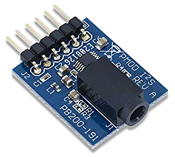

# Low-Pass and High-Pass Filter on Siren

## Objective

* **Implemented on the Nexys A7-100T FPGA a low-pass and high-pass filter that will attenuate (or mute) either the high or low frequencies in an audio signal.**

## Physical Components

* Nexys A7-100T FPGA
* Pmod [I2S (Inter-IC Sound)](https://en.wikipedia.org/wiki/I%C2%B2S) 24-bit [Digital-to-Analog Converter (DAC)](https://en.wikipedia.org/wiki/Digital-to-analog_converter) is required and connects to the [top 6 pins of the Pmod JA port](https://reference.digilentinc.com/_media/reference/programmable-logic/nexys-a7/nexys-a7_rm.pdf).
* Pmod I2S also requires a [3.5-mm connector](https://en.wikipedia.org/wiki/Phone_connector_(audio)) to a speaker or headphones.

## File Components

* ***dac_if.vhd***
  * 16-bit parallel stereo data is converted to serial format that DAC supports
* ***siren.vhd***
  * Top-level file that combines all file sources then sends them to dac_if.vhd
  * lo_tone, hi_tone, and wail_speed constants define the siren
  * 20-bit timing counter tcount generates all necessary timing signals
  * Wail module instance is summoned to initiate 16-bit signed audio sequences data_L and data_R (different data sent to both channels)
  * File sent to instance of dac_if to convert to required serial stream
* ***siren.xdc***
  * Constraint File
  * Add Buttons & Switches to be utilized by the other files
* ***tone.vhd***
  * Frequency of tone is determined by input [pitch](https://en.wikipedia.org/wiki/Pitch_(music))
  * Process cnt_pr generates unsigned sawtooth waveform count by incrementing 16-bit counter pitch values every clock cycle
  * Frequency with which it traverses whole 16-bit count range is thus proportional to pitch
  * Lowest possible tone frequency is obtained when pitch = 1
  * It then takes 216 or 65,536 cycles to traverse the range of the counter
  * Frequency is then 48,800 Hz (48.8 KHz) / 216 or .745 Hz
  * If pitch is set to 1000, frequency would be 1000 * .745 = 745 Hz
  * Select signal assignment statement converts unsigned sawtooth count into signed triangle wave
  * Sawtooth count is split up into 4 quadrants quad and index value within quadrant
  * Signals quad and index generate triangle wave
* ***wail.vhd***
  * Instance of module tone is generated and modulates pitch up and down to produce "wail"
  * Inputs lo_pitch and hi_pitch constrain upper and lower peaks of tone
  * Inputs wspeed and wclk dictate how fast pitch changes
  * Process wp initializes wailing tone
  * Process is run on rising edge of wclk (slow clock of ~ 48 Hz)
    * Every wclk cycle, current pitch is raised or lowered based on updn value
    * updn = '1', pitch rises. updn = '0', pitch lowers
  * wspeed input indicates how much pitch changes each wclk cycle
  * When current pitch exceeds hi_pitch, updn = '0' and pitch starts decreasing
  * When current pitch is lower than lo_pitch, updn = '1' and pitch starts increasing

## Modifications

Lab 5 was utilized as the base to implement a low and high pass filter. The team did not utilize the original Lab 5 code on GitHub as the base but rather the Modifications the team did for Lab 5 for submission that was utilized as the base code. This includes features to change the wail speed and to implement a square wave.  
 
The report will take you through the flow of how data flows through each file and compiles into a single project.

### siren.xdc

To start, switches SW8 and S9 are going to be utilized to activate the low-pass filter (SW8) and high-pass filter (SW9). The statements  
`set_property -dict {PACKAGE_PIN IOSTANDARD LVCMOS33} [get_ports SW8]` and  
`set_property -dict {PACKAGE_PIN IOSTANDARD LVCMOS33} [get_ports SW9]` were inserted after SW7.  
SW8 is assigned to Pin T8 and SW9 is assigned to Pin U8.

### tone.vhd

This is the main code where modifications are made. SW8 and SW9 are initialized as IN ports in the ENTITY tone:  
`SW8 : IN STD_LOGIC;`  
`SW9 : IN STD_LOGIC);`  
 
In the behavioral architecutre of the tone module, signals are created for low pass and high pass versions of triangle and square wave:  
`SIGNAL triangle_wave_lowpass : signed (15 DOWNTO 0);`  
`SIGNAL triangle_wave_highpass : signed (15 DOWNTO 0);`  
`SIGNAL square_wave_lowpass : signed (15 DOWNTO 0);`  
`SIGNAL square_wave_highpass : signed (15 DOWNTO 0);`  
 

After the cnt_pr process begins, conditional statements are made to indicate that the low pass and high pass is initiated.  
 
There are multiple `WITH quad SELECT` statements. The gist for low pass SELECT statements is that the 1st and 2nd quadrants are set to the 16-bit representation of 0, as we want the lower frequencies in the signal to be attenuated (or muted). For high pass SELECT statements, the 3rd and 4th quadrants are set to the 16-bit representation of 0, as we want the higher frequencies in the signal to be attenuated.  
 
Afterwards, a PROCESS called button is initalized with inputs square_wave, square_wave_lowpass, square_wave_highpass, triangle_wave, triangle_wave_lowpass, triangle_wave_highpass.  
The decision tree states that if the square button is pressed, it will go down the square wave conditional. Otherwise, it will go down the triangle wave conditional. Either way, it will generate the given wave but with possible alterations.  
If SW8 is switched on, the low-pass filter will be engaged with the given wave.  
If SW9 is switched on, the high-pass filter will be engaged with the given wave.  
If both are switched on, both filters will be engaged with the given wave, producing a bandgap filter.  
Otherwise, the regular wave of the conditional will be engaged.

### wail.vhd

For both the entity and behavioral architecutre of the wail module, SW8 and SW9 will be initialized as IN ports as in tone.vhd:  
`SW8 : IN STD_LOGIC;`  
`SW9 : IN STD_LOGIC);`  
At the end of the wail module, an instance of tone is created and the outputs of tone.vhd are initialized as the inputs of wail.vhd.  
In this case, SW8 and SW9 from tone.vhd and wail.vhd are paired together.  
`SW8 => SW8, -- low pass`  
`SW9 => SW9); -- high pass`  

### dac_if.vhd

dac_if.vhd is not modified at all for this project.

### siren.vhd

SW8 and SW9 are initialized as IN ports for the siren entity as like before.  
`SW8 : IN STD_LOGIC;`  
`SW9 : IN STD_LOGIC);`  
 
In the behavioral architecture of siren, the wail component has SW8 and SW9 initialized like in the siren entity:  
`SW8 => SW8, -- low pass`  
`SW9 => SW9); -- high pass`  
 
An instance of dac_if called dac AND two instances of wail called w1 and w2 is created. w1 and w2 portmap and map the SW8 and SW9 from wail.vhd to the input SW8 and SW9 in siren.vhd.
`SW8 => SW8, -- low pass`  
`SW9 => SW9); -- high pass`  

## Summary

Marc worked on implementing the VHDL modifications to the Siren project. Jason was responsible for additional research in converting the siren signals to be attenuated at either low or high frequencies. Xavion documented the process the team went through as well as any hardships that happened along the way. 
 
Marc took the equipment home, but the team realized that the DAC brought home was broken, so Marc had to go back into the lab and grabbed a working one.  
